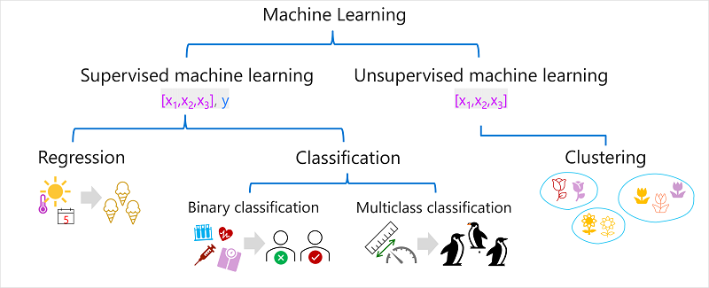

# 🤖💡 What’s Machine Learning?
Machine learning is like when computers learn from data so they can make smart guesses — kind of like how we learn from experience!


## 🧠 Who’s Involved?
It’s a team-up between:

- **Data Scientists 🧪:** They explore and clean up the data, then train the AI to recognize patterns.
- **Software Developers 💻:** They take that trained AI and plug it into apps so it can make predictions in real life!

## 🔁 How It Works:
- Feed the AI lots of data 🍕📊
- Train it to spot patterns 🧠
- Use it in apps to make smart predictions — like guessing what you’ll type next or spotting a cat in a photo 🐱

This last step is called **inferencing** — it’s when the AI uses what it learned to make real-time decisions!

---

## 🧠 Where It Comes From

ML started with **math and stats** — using numbers and patterns to figure things out.  
The big idea? Use past data to guess what might happen next!

---

## 🔍 Real-Life Examples

- 🍦 **Ice Cream Shop**  
  An app looks at past sales + weather to guess how many ice creams will sell today.

- 🩺 **Doctor’s Tool**  
  AI checks patient data to predict if someone might be at risk for diabetes.

- 🐧 **Penguin Research**  
  AI uses bird measurements to figure out which species it is — Adelie, Gentoo, or Chinstrap!

---

# 🧪 How Machine Learning Works

ML is like building a smart calculator that turns **inputs** into **predictions**.

---


## 🧩 Step 1: Training


We give the AI a bunch of examples:

- **Features (x)** = the stuff we know (like weather, weight, flipper size)  
- **Label (y)** = the thing we want to predict (like sales, risk level, penguin type)

Example:

x = [temperature, rainfall, windspeed]
y = ice cream sales


The AI learns a function — let’s call it **f** — that connects x to y:
y = f(x)


---

## 🔮 Step 2: Inferencing

Once trained, the AI can take *new* x values and guess y — this guess is called **ŷ** (aka “y-hat” 🎩).

Example:
ŷ = 120 ice creams 🍦


---

## 💡 Summary

- **Machine Learning** = Smart guessing powered by data + math  
- It learns patterns, builds a function, and makes predictions — all inside your apps!

---

# 🧠 Types of Machine Learning

Machine learning comes in different styles — like different game modes 🎮. You pick the one that fits what you're trying to predict!



---

## 🎓 Supervised Learning

This is when the AI learns from examples that include both:
- **Features (x)** = the stuff we know
- **Labels (y)** = the answer we want it to learn

### 🔢 Regression

Predicts a **number** — like how many ice creams will sell or how fast a car goes.

Examples:
- 🍦 Ice cream sales based on weather
- 🏠 House price based on size and location
- 🚗 Car fuel efficiency based on engine size and weight

### 🧪 Classification

Predicts a **category** — like yes/no or which type of penguin 🐧.

#### ✅ Binary Classification

Only **two options** — like true/false or yes/no.

Examples:
- 🩺 Is a patient at risk for diabetes?
- 💳 Will a customer default on a loan?
- 📬 Will someone respond to a marketing email?

#### 🎯 Multiclass Classification

More than **two categories**, but only one correct answer.

Examples:
- 🐧 Penguin species: Adelie, Gentoo, or Chinstrap
- 🎬 Movie genre: Comedy, Horror, Romance, etc.

#### 🏷️ Multilabel Classification

Sometimes, more than one label fits!

Example:
- 🎥 A movie could be both Sci-Fi *and* Comedy

---

## 🧩 Unsupervised Learning

Here, the AI only gets **features (x)** — no labels. It figures out patterns on its own!

### 🧠 Clustering

Groups similar things together — like sorting socks 🧦 by color and size.

Examples:
- 🌸 Grouping flowers by petal size and shape
- 🛍️ Segmenting customers by shopping habits

> Clustering is like classification, but without knowing the categories ahead of time.  
> You can even use clustering to *find* categories before training a classifier!

---

## 🔁 How It All Connects

Sometimes you:
1. Use **clustering** to find patterns
2. Label those patterns
3. Train a **classification model** to predict future labels

---
# 🤖 What is Regression?

Regression is like teaching AI to **guess numbers** based on patterns it sees in past data.  
It’s part of **supervised learning**, which means the AI learns from examples that include both:
- **Features (x)** = the stuff we know (like temperature)
- **Labels (y)** = the number we want to predict (like ice cream sales)


---

# 🧠 How AI Learns to Predict: 4 Simple Steps

## 1. 🎲 Split the Data
Break your data into two parts:
- **Training data** to teach the AI
- **Validation data** to test how well it learned

---

## 2. 🧠 Train the Model
Use an algorithm (like **linear regression**) to find patterns in the training data and build a model.

---

## 3. 🧪 Test the Model
Use the validation data to make predictions and see how close the AI’s guesses (ŷ) are to the real answers (y).

---

## 4. 📏 Measure & Improve
Compare the predicted answers to the real ones.  
Use metrics (like MAE, MSE, RMSE, or R²) to see how accurate the model is.  
Then tweak the algorithm or settings and repeat until it’s awesome!

---

And that’s how AI gets smarter with every loop! 🔁

---

## 📊 Visual Example

Imagine a scatter plot with dots showing how many ice creams were sold at different temperatures.  
The regression line goes through the middle of the dots, showing the trend.

---

# 🧪 Part 2: Evaluating a Regression Model

Once your model is trained, it’s time to test how well it works!

## 🧾 Step 1: Use the Validation Data

We saved some data earlier — now we use it to:
- Make predictions using the model
- Compare those predictions to the real answers

Example:

| Temperature (x) | Actual Sales (y) | Predicted Sales (ŷ) |
|-----------------|------------------|----------------------|
| 52              | 0                | 2                    |
| 67              | 14               | 17                   |
| 70              | 23               | 20                   |
| 73              | 22               | 23                   |
| 78              | 26               | 28                   |
| 83              | 36               | 33                   |

---

## 📏 How Do We Measure Accuracy?

### 1. **MAE (Mean Absolute Error)**  
Average of how far off the predictions were — no matter if too high or too low.  
🧮 Example: MAE = 2.33 ice creams

### 2. **MSE (Mean Squared Error)**  
Like MAE, but it **squares** the errors — so big mistakes count more.  
🧮 Example: MSE = 6

### 3. **RMSE (Root Mean Squared Error)**  
The square root of MSE — gives us the error in real units (like ice creams!).  
🧮 Example: RMSE = 2.45 ice creams

### 4. **R² (R-Squared)**  
Tells us how much of the pattern the model explains.  
- 1 = perfect prediction  
- 0 = no better than guessing  
🧮 Example: R² = 0.95 (which is awesome!)

---

## 🔁 Keep Improving!

To get the best model, data scientists try different things:
- 🧠 Choose better features
- 🔧 Try different algorithms
- ⚙️ Tweak the settings (called hyperparameters)

They repeat the process until the model is accurate enough to use in the real world!

---
# 🧠 Binary Classification

---

## 🎯 What’s Binary Classification?

Imagine teaching a robot to answer **yes or no** questions. That’s binary classification. It’s like giving the robot a bunch of examples and asking it to guess if something is **true (1)** or **false (0)**.

Instead of guessing numbers (like in regression), the robot guesses **probabilities** — like “I’m 70% sure this person has diabetes.”

---

## 🧪 Training the Robot

We give it data like this:

| Blood Glucose (x) | Diabetic? (y) |
|-------------------|---------------|
| 67                | 0             |
| 103               | 1             |
| 114               | 1             |
| 72                | 0             |
| 116               | 1             |
| 65                | 0             |

Then we use a smart math trick called **logistic regression** to draw an S-shaped curve (called a **sigmoid**) that helps the robot decide.

### 🤖 The Robot’s Brain (Function)

f(x) = P(y = 1 | x)

This means: “What’s the chance y is 1 (true) given x?”

If the robot sees a glucose level of 90 and the curve says 0.9 (90%), it predicts **yes** — this person probably has diabetes.

---

## 🧪 Testing the Robot

We test it with new data:

| Blood Glucose (x) | Diabetic? (y) |
|-------------------|---------------|
| 66                | 0             |
| 107               | 1             |
| 112               | 1             |
| 71                | 0             |
| 87                | 1             |
| 89                | 1             |

The robot makes predictions (ŷ), and we compare them to the real answers (y).

---

## 📊 Confusion Matrix (aka Scoreboard)

| Actual (y) | Predicted (ŷ) | Result         |
|------------|----------------|----------------|
| 0          | 0              | ✅ True Negative |
| 1          | 1              | ✅ True Positive |
| 1          | 1              | ✅ True Positive |
| 0          | 0              | ✅ True Negative |
| 1          | 0              | ❌ False Negative |
| 1          | 1              | ✅ True Positive |

---

## 📈 Metrics That Matter

### 🎯 Accuracy  
How often the robot gets it right:

Accuracy = (TP + TN) / Total = (3 + 2) / 6 = 0.83


### 🔍 Recall  
How many actual diabetics the robot found:

Recall = TP / (TP + FN) = 3 / (3 + 1) = 0.75


### 🎯 Precision  
How many predicted diabetics were actually diabetic:

Precision = TP / (TP + FP) = 3 / (3 + 0) = 1.0


### 🧮 F1-Score  
Combo of precision and recall:

F1 = (2 × Precision × Recall) / (Precision + Recall) = 0.86


---

## 📉 ROC Curve & AUC

We plot how good the robot is at guessing across all thresholds. A perfect robot gets an **AUC of 1.0**. Random guessing gets **0.5**.

Our robot? **AUC = 0.875** 🎉 
That means it’s way better than guessing!

---

## 🧠 TL;DR

Binary classification is like teaching a robot to say **yes or no** based on data. We train it, test it, and score it using metrics like accuracy, recall, precision, and AUC. The better the scores, the smarter the robot!


# 🧠 Multiclass Classification – Level Up Your ML Game 🎮 

## 🚀 What’s the Vibe?

Multiclass classification is like giving your model the power to choose between *more than two* options. Instead of just “yes” or “no,” it’s like “Adelie,” “Gentoo,” or “Chinstrap.” 🐧 It’s part of the supervised ML squad, just like regression and binary classification. You train it, validate it, and test it — classic ML grind.

---

## 🧊 Penguin Example (Because Penguins Are Cool)

We’ve got penguins, and we’re checking out their flipper lengths (📏). Based on that, we wanna guess their species:

- `0`: Adelie  
- `1`: Gentoo  
- `2`: Chinstrap  

| Flipper Length (x) | Species (y) |
|--------------------|-------------|
| 167                | 0           |
| 172                | 0           |
| 225                | 2           |
| 197                | 1           |
| 189                | 1           |
| 232                | 2           |
| 158                | 0           |

*Note: Real-world data would have more features, but we’re keeping it chill with just one.*

---

## 🛠️ How Do We Train This Thing?

We’ve got two main ways to train a multiclass model:

### 1. One-vs-Rest (OvR)  
Train a separate binary classifier for each class. Each one says, “Is this my class or not?”

- `f0(x) = P(y=0 | x)`  
- `f1(x) = P(y=1 | x)`  
- `f2(x) = P(y=2 | x)`  

Whichever one gives the highest probability wins. 🏆

### 2. Multinomial (aka Softmax Squad)  
One model, one function, all the probs:

```text
f(x) = [P(y=0|x), P(y=1|x), P(y=2|x)]
```

Example output: `[0.2, 0.3, 0.5]` → Class 2 wins.

---

## 📊 Time to Evaluate

Let’s see how our model did on some new penguins:

| Flipper Length (x) | Actual (y) | Predicted (ŷ) |
|--------------------|------------|----------------|
| 165                | 0          | 0              |
| 171                | 0          | 0              |
| 205                | 2          | 1              |
| 195                | 1          | 1              |
| 183                | 1          | 1              |
| 221                | 2          | 2              |
| 214                | 2          | 2              |

### 🔍 Confusion Matrix Vibes

| Class | TP | TN | FP | FN | Accuracy | Recall | Precision | F1-Score |
|-------|----|----|----|----|----------|--------|-----------|----------|
| 0     | 2  | 5  | 0  | 0  | 1.00     | 1.00   | 1.00      | 1.00     |
| 1     | 2  | 4  | 1  | 0  | 0.86     | 1.00   | 0.67      | 0.80     |
| 2     | 2  | 4  | 0  | 1  | 0.86     | 0.67   | 1.00      | 0.80     |

### 📈 Overall Stats

- **Accuracy:** (13 + 6) ÷ (13 + 6 + 1 + 1) = **0.90**  
- **Recall:** 6 ÷ (6 + 1) = **0.86**  
- **Precision:** 6 ÷ (6 + 1) = **0.86**  
- **F1-Score:** (2 × 0.86 × 0.86) ÷ (0.86 + 0.86) = **0.86**

---

## 🎉 TL;DR

Multiclass classification = your model picking the best label from a bunch. Whether it’s OvR or softmax, it’s all about those probabilities. And when it’s done right? You get stats that slap. 💥

# 🧠 Clustering – Group Vibes Only 🌸  

## 🤖 What’s Clustering All About?


Clustering is like sorting your playlist by vibe instead of genre. 🎧 It’s **unsupervised ML**, which means no labels, no rules — just grouping stuff based on how similar it is. The model doesn’t know what the “right” answer is. It just finds patterns and builds squads (aka clusters) based on features.

---

## 🌼 Flower Power Example

Imagine you’re a botanist checking out flowers. You count how many **leaves** and **petals** each one has:

| Leaves (x₁) | Petals (x₂) |
|-------------|-------------|
| 0           | 5           |
| 0           | 6           |
| 1           | 3           |
| 1           | 3           |
| 1           | 6           |
| 1           | 8           |
| 2           | 3           |
| 2           | 7           |
| 2           | 8           |

No labels, no species — just raw data. The goal? Group similar flowers together based on leaf and petal counts. 🌿🌸

---

## 🛠️ Training the Model – K-Means Style

One of the go-to clustering algorithms is **K-Means**. Here’s how it rolls:

1. **Vectorize the features** → Turn each flower into a point in space: `[x₁, x₂]`.
2. **Pick your number of clusters (k)** → Say you want 3 squads, set `k = 3`.
3. **Drop random centroids** → These are the squad leaders.
4. **Assign each flower to the closest centroid** → Squad up!
5. **Move centroids to the center of their squad** → Based on average distance.
6. **Reassign flowers if needed** → If they vibe more with another squad.
7. **Repeat until stable** → Or hit max iterations.

🎞️ Imagine an animation where flowers keep switching squads until everyone’s chill.


---

## 📊 Evaluating the Squad Game

Since there’s no “correct” label, we judge clustering by how tight and separate the squads are. Here’s how:

- **Avg distance to cluster center** → How close each flower is to its squad leader.
- **Avg distance to other centers** → How far it is from other squads.
- **Max distance to cluster center** → The outlier in the squad.
- **Silhouette score** → From -1 to 1. Closer to 1 = better squad vibes.

---

## 🎉 TL;DR

Clustering = unsupervised squad building. No labels, just vibes. K-Means helps group similar data points, and we measure how good the squads are by how close and separate they are. 🌈

# 🧠 Deep Learning – Brain Mode Activated 🧬  

## 🤖 What Is Deep Learning?

Deep learning is like giving your computer a mini brain. 🧠 It uses **artificial neural networks** to learn stuff — kinda like how our brains fire signals, but with math instead of electricity.

| 🧬 Real Brain | 💻 AI Brain |
|--------------|-------------|
| Neurons fire signals | Neurons = math functions with weights |
| Signals pass to other neurons | Outputs pass through activation functions |

These networks have **layers on layers** of neurons — that’s why it’s called *deep* learning. You can use it for all kinds of ML tasks: regression, classification, NLP, computer vision — basically, it’s the superhero of ML. 🦸‍♂️

---

## 🐧 Penguin Classifier Example

Let’s say we wanna ID penguin species using deep learning. We feed in some penguin stats:

- Bill length  
- Bill depth  
- Flipper length  
- Weight  

So our input vector is:  
```text
x = [x₁, x₂, x₃, x₄]
```

And we’re trying to predict the species:

- `0`: Adelie  
- `1`: Gentoo  
- `2`: Chinstrap  

The output is a vector of probabilities:  
```text
y = [P(y=0|x), P(y=1|x), P(y=2|x)]
```

### 🧪 Example Run

Input:  
```text
x = [37.3, 16.8, 19.2, 30.0]
```

Output:  
```text
ŷ = [0.2, 0.7, 0.1]
```

Prediction: Class `1` → Gentoo 🐧

---

## 🧠 How Does It Learn?

Training a neural network = teaching it to get better at guessing. Here’s the vibe:

1. **Start with random weights (w)**  
2. **Feed training data (x) through the network**  
3. **Get predictions (ŷ)**  
4. **Compare with actual labels (y)** using a **loss function**  
5. **Calculate how wrong it was**  
6. **Use math magic (gradient descent)** to tweak the weights  
7. **Repeat over multiple rounds (epochs)** until it’s 🔥

### 🧪 Example Loss

Predicted:  
```text
ŷ = [0.3, 0.1, 0.6]
```

Actual:  
```text
y = [0.0, 0.0, 1.0]
```

Loss = difference =  
```text
[0.3, 0.1, 0.4]
```

The model uses this info to adjust weights and get better next time.

---

## ⚡ Pro Tip

Neural networks don’t train one case at a time — they batch data into **matrices** and use **linear algebra** to crunch numbers fast. That’s why we use **GPUs** — they’re built for this kind of heavy lifting. 💪

---

## 🎉 TL;DR

Deep learning = brain-like ML using layers of neurons. It learns by tweaking weights to reduce errors and gets better with each round. Perfect for complex stuff like image recognition, language, and yes — penguins. 🐧💥


# 🤖 Transformers – The Real MVPs of AI 💬  

## 🧠 What’s the Deal?

Transformers are the tech behind all the cool generative AI stuff — like ChatGPT, Bing Chat, and more. They’re built for **natural language processing (NLP)** and can do things like:

- 💬 Understand vibes (sentiment)
- 📚 Summarize stuff
- 🔍 Compare meanings
- ✍️ Generate new text

They’re super smart because they’ve been trained on *massive* amounts of text. The secret sauce? A special architecture called the **Transformer**.

---

## 🏗️ Transformer Architecture 101

Transformers have two main parts:

- **Encoder** → Understands the input text  
- **Decoder** → Generates new text  

They break down text into **tokens** (like words or parts of words), then use a technique called **attention** to figure out which words matter most. The result? Super smart predictions that sound human.

### 🔁 Example Flow

Input: `"When my dog was"`  
Output: `"a puppy"` 🐶

---

## 🧩 Tokenization – Breaking It Down

First step: split text into tokens. Example:

```text
"I heard a dog bark loudly at a cat"
```

Tokens:
- I → 1  
- heard → 2  
- a → 3  
- dog → 4  
- bark → 5  
- loudly → 6  
- at → 7  
- cat → 8  

So the sentence becomes:  
```text
{1 2 3 4 5 6 7 3 8}
```

As training continues, more tokens get added:
- meow → 9  
- skateboard → 10  
- …and so on

---

## 🧠 Embeddings – Giving Tokens Meaning

Token IDs are cool, but they don’t tell us what words *mean*. That’s where **embeddings** come in — they’re vectors (like `[10, 3, 1]`) that represent the *semantic* meaning of a token.

Example:

```text
dog → [10, 3, 2]  
cat → [10, 3, 1]  
puppy → [5, 2, 1]  
skateboard → [-3, 3, 2]
```

Vectors for “dog,” “cat,” and “puppy” point in similar directions → they’re semantically linked. “Skateboard”? Totally different vibe. 🛹

---

## 👀 Attention – What Words Matter Most?

Attention layers help the model figure out which words in a sentence are most important. It’s like giving each word a spotlight based on context.

### 🔍 Self-Attention

In the encoder:  
- “bark” in “dog bark” ≠ “bark” in “tree bark” 
- Context changes meaning → embeddings adapt

In the decoder:  
- Predicts the next word based on what’s already been said  
- Example:  
  ```text
  "I heard a dog" → next word = "bark"
  ```

### 🧠 Positional Encoding

Each token gets a position tag so the model knows the order:
```text
[1,5,6,2] → I  
[2,9,3,1] → heard  
[3,1,1,2] → a  
[4,10,3,2] → dog
```

---

## 🔄 Multi-Head Attention – Supercharged Predictions

Instead of one attention score, the model calculates *multiple* scores using different parts of the embeddings. Then a neural network picks the best next token.

The process repeats:
1. Predict next token  
2. Add it to the sequence  
3. Use the updated sequence to predict the next one  
4. Keep going until the sentence is complete

---

## 🧪 Training vs. Inferencing

During training:
- The model knows the full sentence  
- It masks future tokens and learns by comparing predictions to actual tokens  
- Adjusts weights to reduce errors (loss)

During inferencing:
- The model uses what it’s learned to predict new text  
- No peeking ahead — just vibes and math

---

## ✨ Why Transformers Are 🔥

Models like **GPT-4** are trained on *huge* datasets and use this transformer magic to generate text that feels human. It’s not “thinking” — it’s just really good at predicting what comes next.

So when you type a prompt, it responds with a completion that makes sense — thanks to embeddings, attention, and a massive vocabulary.

---

## 🎉 TL;DR

Transformers = the brains behind generative AI.  
They tokenize text, embed meaning, use attention to focus, and generate smart responses.  
It’s not magic — it’s math, data, and a whole lotta training. 💥

# 🧪 Module Assessment  

### 1️⃣ You want to create a model to predict the cost of heating an office building based on its size in square feet and the number of employees working there. What kind of machine learning problem is this?

- [ ] Regression  
- [ ] Classification  
- [ ] Clustering  

---

### 2️⃣ You need to evaluate a classification model. Which metric can you use?

- [ ] Mean squared error (MSE)  
- [ ] Precision  
- [ ] Silhouette  

---

### 3️⃣ In deep learning, what is the purpose of a loss function?

- [ ] To remove data for which no known label values are provided  
- [ ] To evaluate the aggregate difference between predicted and actual label values  
- [ ] To calculate the cost of training a neural network rather than a statistical model  
