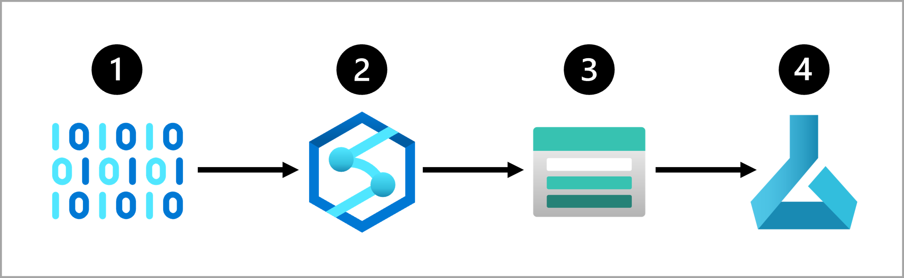

# 🧠 Designing ML Solutions – From Idea to Impact 🚀  

## 💡 Why It Matters

Machine learning (ML) is the engine behind today’s smartest tech — from Netflix recs to predicting the weather. 🌦️ It turns data into insights and powers everything from chatbots to self-driving cars.

But building a solid ML solution? That takes planning. The choices data scientists make affect how fast, cheap, accurate, and long-lasting the solution is.

## 🔁 The 6-Step ML Flow

> *Note: This is a simplified version — in real life, you’ll loop back and tweak things as you go.*

### 1️⃣ Define the Problem  
🎯 What are you trying to predict? How will you know if it’s working?

### 2️⃣ Get the Data  
🔍 Find the right data sources and get access.

### 3️⃣ Prepare the Data  
🧹 Clean it. Transform it. Make it model-ready.

### 4️⃣ Train the Model  
🧪 Pick an algorithm. Tune the settings. Test and repeat.

### 5️⃣ Integrate the Model  
🚀 Deploy it to an endpoint so it can start making predictions.

### 6️⃣ Monitor the Model  
📊 Track how it’s doing. If it drifts, retrain and improve.

---

## 🎉 TL;DR

ML isn’t just about code — it’s about smart design. With the right steps and tools (like Azure), you can build models that actually work in the real world. 🌍💡

# 🎯 Define the Problem – Step 1 of ML Mastery  

## 🧠 What’s the Goal?

Before you build anything, you gotta know what you’re solving. This step is all about figuring out:

- 🤔 What should the model predict?  
- 🧩 What kind of ML task is this?  
- 🏆 How do we know if it’s working?

The type of task you’re doing depends on your data and what kind of output you want. That choice affects which algorithms you can use.

## 🔍 Common ML Tasks

Here are the big five:

- 🏷️ **Classification** → Predict a category (e.g., yes/no, type of animal)  
- 🔢 **Regression** → Predict a number (e.g., price, temperature)  
- 📈 **Time-Series Forecasting** → Predict future numbers over time  
- 🖼️ **Computer Vision** → Understand images (e.g., detect objects)  
- 💬 **Natural Language Processing (NLP)** → Understand and generate text  

---

## 🧪 Example: Diabetes Detection

Let’s say you want to find out if a patient has diabetes. You’ve got health data like blood sugar, weight, etc. The output is either:

- ✅ Has diabetes  
- ❌ Doesn’t have diabetes  

That’s a **classification** task because the answer is a category.

## 🛠️ The ML Workflow (Simplified)

Here’s a 7-step flow to train your model:

1. 📥 **Load data** → Import and check it out  
2. 🧹 **Preprocess data** → Clean it up and normalize  
3. ✂️ **Split data** → Train/test split  
4. 🧠 **Choose model** → Pick your algorithm  
5. 🏋️ **Train model** → Learn from the training data  
6. 📊 **Score model** → Test it on new data  
7. ✅ **Evaluate** → Check how well it did (accuracy, precision, etc.)

> 🔁 Heads up: This isn’t a one-and-done thing. You’ll probably loop through these steps a few times to get the best results.

---

## 🎉 TL;DR

Start smart: Know what you’re solving, what kind of ML task it is, and how you’ll measure success. That’s how you build models that actually work. 💡

# 📦 Get & Prep the Data – Step 2 of ML Flow  

## 🧠 Why It Matters

Data is the fuel for machine learning. 🚀  
More data = better predictions.  
Better quality = smarter models.

To train your model, you need to:

1. 🔍 Find your data source  
2. 🍽️ Choose how to serve it  
3. 🛠️ Build a data ingestion pipeline  

---

## 🔍 Step 1: Know Your Data

| What to Identify | Examples |
|------------------|----------|
| **Data Source** | CRM system, SQL database, IoT device |
| **Data Format** | Tabular (structured), semi-structured (like JSON), or unstructured (like images or text) |

Once you know what you’ve got, decide what you *need* for training and how to format it.

---

## 🔄 Step 2: Ingest the Data

You’ll need to **Extract**, **Transform**, and **Load** (ETL) your data into a place where Azure can use it.

### 🔁 ETL Flow:

1. 📤 Extract raw data (e.g., from IoT or CRM)  
2. 🔄 Transform it (clean, reshape, aggregate)  
3. 📥 Load it into Azure Blob Storage or another serving layer  
4. 🧠 Train your model with Azure Machine Learning  

You can automate this with tools like:

- Azure Synapse Analytics  
- Azure Databricks  
- Azure Machine Learning Pipelines  

---

## 🧪 Example: Weather Forecasting 🌦️

You’ve got IoT devices measuring temperature every minute. But you want hourly averages in a clean table.

### Here's the flow:

1. 📥 Extract JSON data from IoT devices  
2. 🔄 Convert JSON to a table  
3. 📊 Transform it to show average temp per hour per device  

Now you’ve got a dataset ready for training your forecasting model. ✅

---

## 🎉 TL;DR

Good data = good models.  
Find it, clean it, transform it, and serve it up to Azure.  
That’s how you prep like a pro. 💪

# 🏋️ Train the Model – Step 3 of ML Flow  

## 🧠 Pick Your Training Setup

Training a model = teaching it to make smart predictions.  
But how you train depends on:

- 🤖 What kind of model you need  
- 🎮 How much control you want  
- ⏳ How much time you’ve got  
- 🧰 What tools your org already uses  
- 💬 What coding language you vibe with  

---

## 🔧 Azure Training Tools

Here are the top picks in the Azure ecosystem:

### 🧠 Azure Machine Learning  
All-in-one ML platform.  
Use the Studio for drag-and-drop or go full code with Python SDK or CLI.  
Perfect for end-to-end ML workflows.

### 🔥 Azure Databricks  
Built for big data and fast compute.  
Great for data engineering + data science.  
Works solo or integrates with Azure ML.

### 📊 Microsoft Fabric  
One-stop shop for analytics.  
Prep data, train models, make predictions, and visualize in Power BI.  
Super smooth for collab between analysts, engineers, and scientists.

### 🧠 Azure AI Services  
Prebuilt models ready to go (like image detection).  
Use APIs to plug ML into your app fast.  
Some models are customizable with your own data.

---

## 💡 Why Azure Machine Learning Slaps

Azure ML is the go-to for training, deploying, and managing ML models.  
It’s built for data scientists, devs, and ops teams to run full ML lifecycles.

### 🔍 What You Can Do:

- Explore + prep data  
- Train + evaluate models  
- Register + manage models  
- Deploy models to apps  
- Apply responsible AI (fairness, explainability, etc.)

### 🛠️ Key Features:

- Centralized dataset storage  
- On-demand compute for training  
- AutoML to test multiple algorithms + settings  
- Visual pipelines for training + inferencing  
- Integration with MLflow for tracking + scaling  
- Built-in tools for responsible AI metrics

---

## 🎉 TL;DR

Training your model = choosing the right tools + setup.  
Azure gives you options whether you want full control or fast results.  
Next up: let’s get hands-on with Azure ML Studio. 💻✨

# 💻 Use Azure ML Studio – Step 4 of ML Flow  

## 🧠 What’s Azure ML Studio?

Azure Machine Learning Studio is your browser-based HQ for all things ML.  
No installs. No stress. Just log in and start building models like a boss. 🧑‍💻

### What You Can Do:

- 📥 Import + explore data  
- ⚙️ Create compute (aka cloud power)  
- 📓 Run code in notebooks  
- 🧩 Build jobs + pipelines visually  
- 🤖 Use AutoML to train models without writing code  
- 📊 Check out model metrics + responsible AI info  
- 🚀 Deploy models for real-time or batch predictions  
- 📦 Manage models from a full-on model catalog  

## 🛠️ Set Up Your Workspace

To get started, you need an **Azure ML workspace**.  
It’s the main resource where all your ML magic happens.  
Azure auto-creates the extras (like storage, VMs, etc.) when you set it up in the Azure portal.

---

## ⚡ Choose Your Compute

Training = compute power. You’ve got options:

| Compute Type | Best For |
|--------------|----------|
| **CPU** | Small tabular data, low cost  
| **GPU** | Images, text, big data, faster training  
| **General Purpose** | Balanced CPU/memory – great for dev + testing  
| **Memory Optimized** | Big data, in-memory analytics, notebooks  

> 💡 Tip: Monitor your compute usage. If training is slow, try scaling up or switching to GPU. You can even go distributed with Spark (but that means rewriting your code).

---

## 🤖 AutoML = Easy Mode

Don’t wanna write code? No problem.  
**Azure AutoML** lets you train models with a step-by-step wizard.

### AutoML Supports:

- 🔢 Regression  
- 📈 Time-series forecasting  
- 🏷️ Classification  
- 🖼️ Computer vision  
- 💬 NLP  

You bring the data, AutoML does the rest — and you can deploy your model as a service when it’s ready.

---

## 🎉 TL;DR

Azure ML Studio = your all-in-one ML control center.  
Train, test, deploy, and manage models — with or without code.  

# 🔗 Integrate a Model – Step 5 of ML Flow  

## 🚀 Why Integration Matters

Once your model is trained, it’s time to plug it into the real world.  
That means **deploying it to an endpoint** so apps can use it to make predictions.

You’ve got two main options:

- ⚡ **Real-time predictions** → Instant results  
- 📦 **Batch predictions** → Process data in chunks  

---

## 🌐 Deploy to an Endpoint

An **endpoint** is like a smart URL your app can call to get predictions.

### 🔥 Real-Time Predictions

Perfect for apps that need instant feedback — like mobile apps or websites.

**Example:**  
A customer clicks on a shirt → model instantly recommends matching items.  
The page loads, and boom 💥 — recommendations are ready.

### 📊 Batch Predictions

Great for scheduled jobs or big data reports.

**Example:**  
You forecast orange juice sales weekly.  
Collect data all week → run the model once → update your report with predictions.

---

## 🤔 Real-Time vs Batch – How to Choose

Ask yourself:

- 🕒 How often do I need predictions?  
- ⏱️ How fast do I need results?  
- 🧍‍♂️ Do I need predictions one-by-one or in bulk?  
- 💸 What’s my compute budget?

---

## 📅 Frequency of Scoring

It’s not just about how often data comes in — it’s about how fast you need answers.

- ⚡ **Real-time** → Predict instantly when data arrives  
- 🕰️ **Batch** → Predict later, when you’ve collected enough data

**Examples:**

- IoT device → sends temp every minute  
- Web shop → logs every purchase  
- Finance system → updates quarterly

---

## 📋 Individual vs Batch Predictions

Imagine a table of customer data:

- Each row = one customer  
- You want to predict if they’ll buy again

You can:

- 🧍‍♂️ **Individual** → One row in, one prediction out  
- 📊 **Batch** → Whole table in, predictions for everyone

Same goes for files — score one image or a whole folder.

---

## 💸 Compute Costs Matter

Training isn’t the only time you need compute — deployment uses it too.

### ⚡ Real-Time Compute

Needs to be **always on** and **super fast**.  
Use containers like:

- Azure Container Instance (ACI)  
- Azure Kubernetes Service (AKS)

⚠️ You pay continuously — even when no one’s using it.

### 📦 Batch Compute

Needs to handle **big jobs** but can chill when idle.  
Use compute clusters that:

- Scale up when scoring starts  
- Scale down to zero when done

✅ Saves 💰 when not in use.

---

## 🎉 TL;DR

Deploying your model = making it useful.  
Choose between real-time or batch based on speed, scale, and cost.  
Next up: let’s talk deployment options. 🚀

# Azure Machine Learning Quiz

## Question 1
**What does Automated machine learning in Azure Machine Learning enable you to do?**

- [ ] Automatically deploy new versions of a model as they're trained  
- [ ] Automatically provision Azure Machine Learning workspaces for new data scientists in an organization  
- [ ] Automatically run multiple training jobs using different algorithms and parameters to find the best model  

---

## Question 2
**Which of the following factors should you consider when choosing a service to train a machine learning model?**

- [ ] The number of users in your organization  
- [ ] How much time you want to invest in model training  
- [ ] The approximate number of predictions the model needs to make in a month  

---

## Question 3
**What is a key feature of Azure Machine Learning that supports end-to-end machine learning workflows?**

- [ ] It provides ready-to-use models for image classification  
- [ ] It requires integration with Microsoft Fabric to deploy models  
- [ ] It offers centralized dataset management and automated machine learning  

