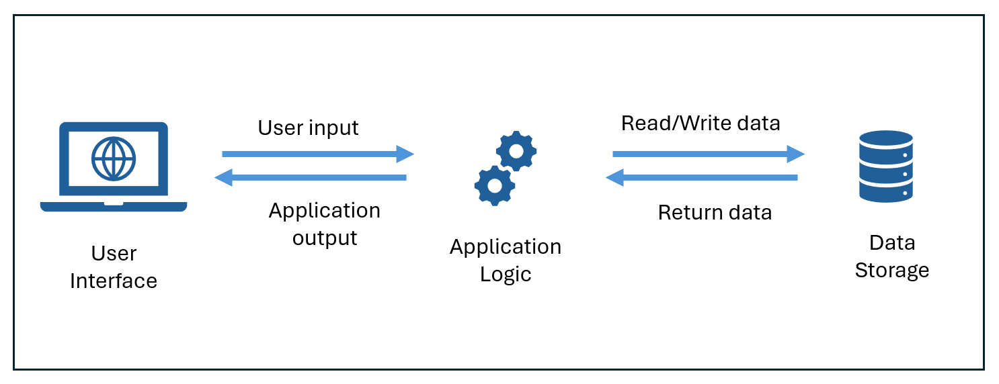
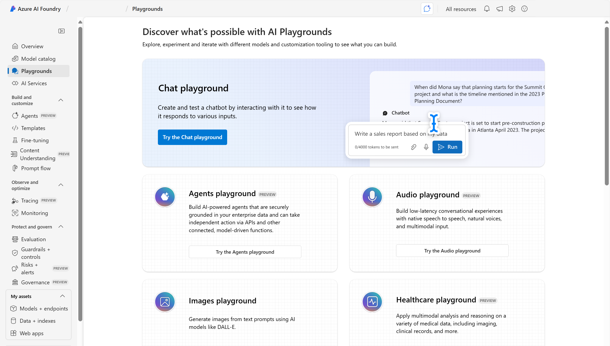

# 🚀 Intro to Generative AI Magic

## 💥 Generative AI = Game Changer

In just a few years, generative AI has flipped the tech world upside down! 🤯  
It’s all about creating new stuff — text, images, code, you name it.  
Even pro devs are like, “Whoa, this is moving FAST!” 🏃‍♂️💨

---

## 🧠 What You’ll Learn

This module gives you the lowdown on how generative AI works and how Microsoft Azure AI helps you build cool stuff. 💡

---

## 🔍 Real-World Use Cases

Here’s how people are using it right now:

- ✍️ **Marketing Content**: Copilot writes product descriptions, blog posts & social media captions — fast & on-brand.
- 💬 **Customer Support**: AI chatbots answer questions 24/7 so human agents can chill. 😎
- 💻 **Code Generation**: GitHub Copilot helps devs write code from natural language prompts. Less typing, more shipping! 🚢
- 🎨 **Image & Video Creation**: Azure AI Foundry turns text into visuals for campaigns, storyboards & concept art.
- 📚 **Personalized Learning**: AI makes custom quizzes & study guides based on how YOU learn best. 🧠✨

---

## 🧰 Microsoft’s AI Toolbox

Microsoft’s got a whole ecosystem of tools to help you build epic generative AI apps.  
Next up: Let’s explore the wild world of generative AI applications! 🌍🚀

# 🤖 Understanding Generative AI Apps

## 🧠 What Powers These Apps?

Generative AI apps run on **language models** — they’re the brains behind the scenes 🧠💬  
These models handle the logic and make the magic happen when you chat with AI.

---

## 💬 Meet the Assistants

Think: chatbots that actually *get* you.  
Like **Microsoft Copilot** — your AI-powered work buddy that helps write, plan, and get stuff DONE. 📝⚡

> 💡 Copilot lives inside Microsoft apps and boosts productivity with smart content + task automation.  
> Devs can even build plug-ins or create their own Copilot-style agents. 🔧🧑‍💻

---

## 🕹️ Meet the Agents

Agents = AI that *does stuff* for you.  
Like filing taxes, booking rides, or sending meeting maps. 🗺️🚕

Agents have 3 key parts:

1. 🧠 Language model (for thinking + understanding)
2. 📋 Instructions (goals + rules)
3. 🛠️ Tools (to actually do the tasks)

> 💡 Most AI apps today mix assistants + agents + other cool features.  
> Managing all these parts together = **orchestration** 🎶🤖

---

## 🧰 Types of Generative AI Apps

Let’s break it down into 3 buckets 🪣👇

### ✅ Ready-to-Use  
Just start typing! No coding needed.  
Perfect for quick tasks + casual users.

### 🔧 Extendable  
Use your own data to make it smarter.  
Example: Microsoft Copilot — ready-to-go *and* customizable.

### 🏗️ Build-Your-Own  
Start from scratch with a language model.  
Create your own assistant or agent with full control.

---

## 🛠️ Tools to Build With

Microsoft’s got your back:

- 🧠 **Copilot Studio** — extend Microsoft 365 Copilot
- 🚀 **Azure AI Foundry** — build custom AI from different models

# 🛠️ Tools to Build Generative AI Like a Pro

## 🚀 Microsoft’s AI Toolbox = Total Power-Up

Microsoft’s got a whole squad of tools to help devs, data nerds, and big biz build epic generative AI apps. 💪  
This module zooms in on **Azure AI Foundry** — the ultimate platform for building, customizing, and launching AI magic. ✨

---

## 🧱 What’s Azure AI Foundry?

It’s a **PaaS** (Platform as a Service) that gives you full control over your AI builds.  
You can tweak language models, deploy them in the cloud ☁️, and plug them into your own apps and services. 🔌
Use the **Azure AI Foundry portal** to:

- Build 🏗️  
- Customize 🎨  
- Manage 🧠  
- Launch 🚀  

---

## 🔍 Foundry Components Breakdown

| 🧩 Component | 💬 What It Does |
|-------------|----------------|
| 📚 Model Catalog | Discover, compare, and deploy all kinds of generative AI models |
| 🧪 Playgrounds | Test ideas, try models, and explore Azure AI services — fast! |
| 🛠️ Azure AI Services | Build, demo, test, and deploy AI tools |
| 🧠 Solutions | Create agents + customize models |
| 📊 Observability | Track how your models are doing in real time |

---

## 💬 Bonus Tool: Copilot Studio

Want to build chatbots without hardcore coding?  
**Copilot Studio** is your low-code BFF. 💻✨

- Create conversational AI experiences  
- Hosted in Microsoft 365  
- Works in chat apps like Teams 💬  
- No stress about infrastructure — it’s all managed for you 🙌

👉 Learn more: Microsoft Copilot Studio

# 🧠 Azure AI Foundry's Model Catalog: Pick Your Power-Up!

## 🛍️ What’s in the Catalog?

Azure AI Foundry = your go-to marketplace for AI models!  
It’s packed with models from Microsoft, partners, and the community. 💥  
Think of it like the App Store — but for AI brains. 🧠📲

## 🧠 Foundation Models = Built-In Genius

Microsoft’s own models (like Azure OpenAI) are called **foundation models**.  
They’re trained on *huge* amounts of text and ready to go! 🚀  
Want them to be extra smart at something? You can **customize** them too. 🎨

---

## 🧪 Try Before You Deploy

Not sure which model to pick? No stress!

- 🧪 Use **playgrounds** to test different models
- 🏆 Check out **model leaderboards** (preview!) to see which ones are crushing it in:
  - Quality 💎  
  - Cost 💸  
  - Speed ⚡

You even get cool graphs to compare models side-by-side. 📊👀

## 🔜 What’s Next?

Let’s dive into how to get started with Azure AI Foundry and unlock its full potential! 🗝️🚀

# 🧠 Azure AI Foundry: Unlock the Cool Stuff

## 🛠️ What’s Inside the Foundry?

The **Azure AI Foundry portal** is your control center for building awesome AI apps.  
It’s built around **hubs** and **projects** — like folders for your AI ideas. 📁💡

- 🏢 **Hubs** = full access to Azure AI + Machine Learning
- 📂 **Projects** = focused access to models + agent building

Manage everything from the **overview page** — easy peasy! 👀

---

## 🔍 What You Can Do

When you create a hub, you also get access to:

- 🗣️ Azure AI Speech  
- 📚 Azure AI Language  
- 👁️ Azure AI Vision  
- 🛡️ Content Safety tools  

Test them all in **playgrounds** — like mini labs for your ideas! 🧪🎮

## 🎨 Customize Your Models Like a Pro

Want your AI to be smarter, safer, and more accurate?  
Here are 4 ways to level it up:

| 🔧 Method | 💬 What It Does |
|----------|-----------------|
| 📌 Grounding Data | Links your model to real, reliable info (like databases or search engines) to keep answers factual |
| 🔍 RAG (Retrieval-Augmented Generation) | Connects your model to your company’s data for super smart, context-aware replies |
| 🧠 Fine-Tuning | Trains your model on specific tasks so it gets better at niche stuff |
| 🔐 Security & Governance | Keeps your AI safe, private, and under control — no sketchy outputs allowed! |

---

Let’s check out how Azure AI Foundry helps you **track performance** and keep your AI running smooth! 📊⚙️

# 👀 Observability: Keep Your AI in Check

## 📊 What’s Observability?

Observability = watching your AI like a hawk 🦅  
It’s all about making sure your generative AI is doing a great job — safely, smartly, and smoothly. 💡

---

## 🧠 3 Ways to Evaluate AI

Here’s how we break it down:

1. 🎯 **Performance & Quality**  
   Is the response accurate, relevant, and grounded in real info?

2. ⚠️ **Risk & Safety**  
   Is the AI avoiding harmful or sketchy content?

3. 🛠️ **Custom Evaluators**  
   Got industry-specific goals? Use custom metrics to track what matters to YOU.

---

## 🧪 Evaluators in Azure AI Foundry

Foundry’s got built-in tools to help you measure your AI’s vibe. Here are some of the MVPs:

- 📌 **Groundedness**: Is the response backed by real context?
- 🎯 **Relevance**: Does it actually answer the question?
- 🗣️ **Fluency**: Is it smooth and readable?
- 🔗 **Coherence**: Does it make logical sense?
- 🛡️ **Content Safety**: Is it safe and respectful?

---

# ✅ Check Your Knowledge

## Question 1  
**Which of the following best describes the role of a generative AI agent?**

- [ ] A chatbot that answers questions using pre-written responses  
- [ ] An application that can understand input, reason, and take actions autonomously  
- [ ] An application that monitors AI model performance  

---

## Question 2  
**Which of the following best describes the purpose of the Azure AI Foundry model catalog?**

- [ ] It stores user-generated content for Copilot Studio projects  
- [ ] It exists so users can compare the cost of all Azure services in a subscription  
- [ ] It is a centralized hub for discovering, comparing, and deploying models for generative AI  

---

## Question 3  
**What is the purpose of fine-tuning in the context of generative AI?**

- [ ] It's used to manage access, authentication, and data usage in AI models  
- [ ] It involves connecting a language model to an organization's proprietary database  
- [ ] It involves further training a pretrained model on a task-specific dataset to make it more suitable for a particular application  

