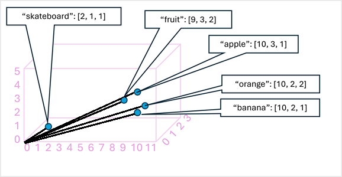

# 👀💡 What’s Computer Vision? Let’s Break It Down


Computer vision is like giving AI a pair of digital eyes. It helps machines *see* the world and actually *understand* what’s going on. No eyeballs needed—just pixels and brainpower.

---

## 🔍 Real-Life Scenarios Where CV Pops Off

- 🏥 **Hospitals**  
  Track surgical tools in real-time during operations. No more “where’s that scalpel?” moments.

- 🛍️ **Retail**  
  Auto-sort product pics—shoes, shirts, gadgets—into categories. Instant inventory magic.

- 🐾 **Wildlife Watchers**  
  Spot animals in video footage. Think: “That’s a tiger!” not “What’s that blur?”

- 🚗 **City Traffic Teams**  
  Read license plates from images. Fast, accurate, and no human squinting required.

- 🏭 **Manufacturing**  
  Scan for defects in visual patterns. Catch the flaws before they hit the shelves.

---

## 🧠 How It Works

Okay, so computers don’t have eyes like us. But they *do* have the power to process images—whether it’s from a live camera feed or a saved photo/video.

This image-processing skill is the secret sauce behind software that mimics human vision. It’s how AI starts to *see* and *think* visually.


---

## 🔧 What’s Next?

In this module, we’ll dive into the building blocks of modern computer vision. Get ready to explore how machines turn pixels into perception.

# 👁️💥 Computer Vision — What It Can Do & How It Sees

Computer vision is like giving AI supercharged digital eyes. It doesn’t just look—it *understands*. Let’s break down the main types of CV powers:


## 🧠 Core CV Capabilities

| Type                     | What It Does                                                                 |
|--------------------------|------------------------------------------------------------------------------|
| 🖼️ Image Analysis         | Detects, classifies, captions, and pulls insights from pics.                 |
| 📍 Spatial Analysis       | Tracks people’s movements IRL in real time.                                 |
| 🧑 Facial Recognition     | Knows who’s who—verifies identity like a boss.                              |
| 🔤 OCR (Text Detection)   | Reads printed or handwritten text in any style or language.                 |

---

## 🖼️ How AI Sees — It’s All Pixels, Baby

To a computer, an image = a grid of numbers. Each number = a pixel value. Here's a 7x7 grayscale example:

0 0 0 0 0 0 0
0 0 0 0 0 0 0 0 0 255 255 255 0 0 0 0 255 255 255 0 0 0 0 255 255 255 0 0 0 0 0 0 0 0 0 0 0 0 0 0 0 0


- `0` = black  
- `255` = white  
- Anything in between = shades of gray

This is a **grayscale image**. But most images are in **color**, which means 3 layers: **Red**, **Green**, and **Blue** (aka RGB).

---

## 🎨 RGB Breakdown — Color Vibes

Here’s how a color image is built using RGB channels:

### 🔴 Red Channel:
 150  150  150  150  150  150  150  
 150  150  150  150  150  150  150
 150  150  255  255  255  150  150
 150  150  255  255  255  150  150
 150  150  255  255  255  150  150
 150  150  150  150  150  150  150
 150  150  150  150  150  150  150

### 🟢 Green Channel:
 0    0    0    0    0    0    0          
 0    0    0    0    0    0    0
 0    0   255  255  255   0    0
 0    0   255  255  255   0    0
 0    0   255  255  255   0    0
 0    0    0    0    0    0    0
 0    0    0    0    0    0    0

### 🔵 Blue Channel
 255  255  255  255  255  255  255  
 255  255  255  255  255  255  255
 255  255   0    0    0   255  255
 255  255   0    0    0   255  255
 255  255   0    0    0   255  255
 255  255  255  255  255  255  255
 255  255  255  255  255  255  255

Here's what it looks like:


## 🎨 Color Combos

- **Purple Squares** =  
  - Red: 150  
  - Green: 0  
  - Blue: 255  

- **Yellow Squares (Center)** =  
  - Red: 255  
  - Green: 255  
  - Blue: 0  

---

## 🔜 What’s Next?

Now that we know how AI sees, let’s explore how it *processes* those images to make smart decisions.

# 🧠 Understand Image Processing

## 🎨 What’s Image Processing?
Image processing is like giving your image a makeover using filters! These filters change the pixels (tiny dots of color) to create cool effects like sharpening, blurring, or highlighting edges.

## 🧰 What’s a Filter?
A filter uses a tiny grid of numbers called a kernel. Think of it like a stencil that slides over your image and changes it based on math.

Here’s an example of a 3x3 kernel:

-1 -1 -1  
-1  8 -1  
-1 -1 -1

This one is called a Laplace filter—it helps find the edges in an image.

## 🖼️ Let’s Try It!
Here’s a simple grayscale image (black = 0, white = 255):

 0   0   0   0   0   0   0  
 0   0   0   0   0   0   0  
 0   0 255 255 255  0   0  
 0   0 255 255 255  0   0  
 0   0 255 255 255  0   0  
 0   0   0   0   0   0   0  
 0   0   0   0   0   0   0
Now we slide the filter over the image and do some math:

🔍 First Patch:
(0×-1) + (0×-1) + (0×-1) +  
(0×-1) + (0×8) + (0×-1) +  
(0×-1) + (0×-1) + (255×-1) = -255
👉 Next Patch:
(0×-1) + (0×-1) + (0×-1) +  
(0×-1) + (0×8) + (0×-1) +  
(0×-1) + (255×-1) + (255×-1) = -510
So far, our new image looks like this:

-255  -510
We keep sliding the filter across the image until we’ve covered it all!


## 🧠 What’s Happening?
The filter highlights edges in the image.
Some values might go below 0 or above 255, so we adjust them to stay in range.
The edges of the image don’t get calculated, so we pad them with 0s.

## 🍌 Real Example


Banana photo	Banana with edges highlighted
This is called convolutional filtering—because the filter is convolved (slid and calculated) across the image.

## 🧪 What’s Next?
Let’s connect this to how modern vision models (like AI that sees) use convolutional filtering to understand images!

# 🧠 From Filters to Smart Vision: How Computers Learn to See  
**🎯 Level Up Your AI Skills**  
**⏱️ 5–7 minutes**

---

## 🎨 Filters Are Cool, But Seeing Is Smarter

Sure, filters can make your pics look awesome—sharper, blurrier, or more artsy. But in **computer vision**, the goal isn’t just to make images look cool. It’s to help computers **understand what’s in the image**—like spotting a banana or a cat—and make smart decisions based on that.

---

> 💡 **Heads up!**  
> This section assumes you already know the basics of **machine learning** and have heard of **deep learning** and **neural networks**.  
> If not, check out the https://learn.microsoft.com/training/modules/create-regression-models-azure-machine-learning/ on Microsoft Learn!

---

## 🧠 What’s a CNN?

A **Convolutional Neural Network (CNN)** is a special kind of deep learning model that’s super good at looking at images.

Here’s how it works:

1. **Filters** scan the image and pull out important details (like edges, shapes, or colors).
2. These details become **numbers** (called feature maps).
3. The numbers go into a **neural network** that figures out what the image is.

### 🍎 Example:
You train a CNN with lots of fruit pics—apples, bananas, oranges.  
Then, when you show it a new fruit pic, it says:  
> “Hey, that’s a banana!” 🍌


## 🛠️ How CNNs Learn

When training starts, the filters are just random numbers. But as the model sees more images and compares its guesses to the correct answers, it **tweaks the filters** to get better.

### 🔁 Training Loop:
- Show the model a labeled image (like “this is an orange”).
- The model makes a guess (maybe “banana”).
- It checks how wrong it was.
- It adjusts the filters and tries again.
- Repeat this over and over (called **epochs**) until it gets really good.

---

## 🧪 What’s Inside a CNN?

Here’s a simplified breakdown:

1. **Input**: Images with labels (like 0 = apple, 1 = banana, 2 = orange).
2. **Convolution Layers**: Filters scan the image and create feature maps.
3. **Flattening**: The feature maps are turned into a long list of numbers.
4. **Fully Connected Layers**: These numbers go into a neural network.
5. **Output**: The model gives a probability for each label, like:
   ```

   [0.2, 0.5, 0.3] → Most likely a banana!
   
6. **Loss Calculation**: The model compares its guess to the real answer and learns from the mistake.

---

## 🧠 Bonus Tip

Real CNNs have **lots of layers**—some shrink the image, some clean up the data, and others help the model focus on the most important parts. But the key idea is this:

> **Filters turn images into numbers. Neural networks turn numbers into answers.**

---

## 🚀 What’s Next?

Now that you know how CNNs work, let’s see how they power real-world computer vision tasks—like facial recognition, self-driving cars, and more!

# 👁️‍🗨️ Understand Modern Vision Models  

## 📸 CNNs: The OG of Computer Vision

CNNs (Convolutional Neural Networks) have been the go-to tech for helping computers “see” for years. They’re great at figuring out what’s in a picture—like “that’s a dog” or “that’s a skateboard.”

But CNNs can do more than just label stuff. They’re also used in **object detection**, which means spotting **multiple things** in one image and figuring out **where** they are.

---

## 🤖 Transformers: From Text to Vision
While CNNs ruled vision, **transformers** were crushing it in **language** (like chatbots and translation). Transformers read tons of text and turn words into **vectors**—basically, numbers that represent meaning.



### 🧠 Word Vibes in 3D
Imagine words floating in 3D space. Words that mean similar things (like “cat” and “kitten”) are close together. That’s how transformers understand language.

> ⚠️ Real transformers use way more than 3 dimensions—like hundreds! But 3D is easier to picture.

---

## 🧩 Multi-Modal Models: Best of Both Worlds

Now imagine combining **image understanding** with **language understanding**. That’s what **multi-modal models** do!

They’re trained on **captioned images** (like a pic of a dog with the caption “cute puppy”). These models learn how **pixels** and **words** connect.

!Multi Modal](/../assets/multi-modal-model.png)

### 🧠 How It Works:
- An **image encoder** turns the picture into numbers.
- A **language encoder** turns the caption into numbers.
- The model learns how they match up.

<video src="../assets/20250707-124105-sora.mp4" controls autoplay loop muted playsinline style="max-width: 100%; height: auto;">
  Your browser does not support the video tag.
</video>

## 🏗️ Foundation Models: Build Once, Use Everywhere

Modern vision models are trained on **huge datasets** from the internet. These are called **foundation models**—they’re like the base of a LEGO set.

You can build different tools on top of them, like:

- 🖼️ **Image Classification** – What is this image?
- 🔍 **Object Detection** – Where are the things in this image?
- 📝 **Captioning** – Describe this image in words.
- 🏷️ **Tagging** – Add relevant keywords to the image.


---

## 🚀 Why It Matters

Multi-modal models are the **future of AI**. They’re helping us build smarter tools that can understand both **what they see** and **what they read**—just like humans.

# 🧠 Computer Vision Quiz

---

## 1. What kind of values does computer vision analyze in an image?

- [ ] Timestamps in photograph metadata  
- [x] Pixels  
- [ ] Image file names  

---

## 2. What is the primary role of filters in a convolutional neural network (CNN) used for image classification?

- [ ] To apply visual effects to enhance image appearance  
- [x] To extract numeric features from images for use in a neural network  
- [ ] To compress image size for faster processing  

---

## 3. What is the primary function of a multi-modal model in computer vision?

- [ ] To generate random captions for unlabeled images  
- [ ] To replace CNNs entirely in all vision tasks  
- [x] To combine image features with natural language embeddings for richer understanding  


