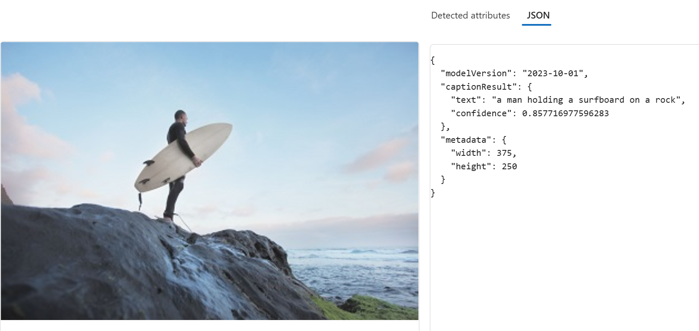
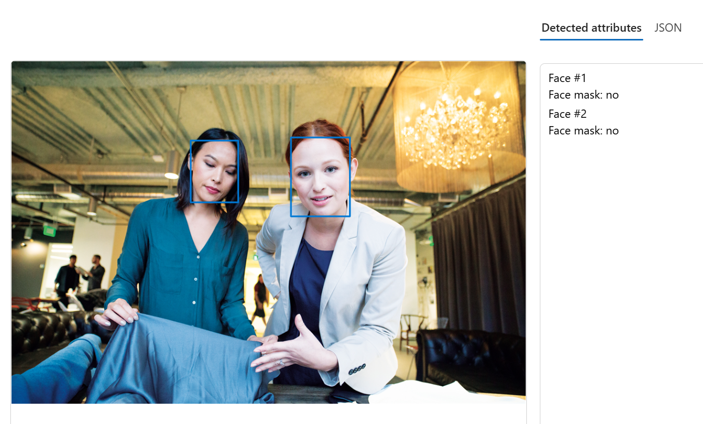
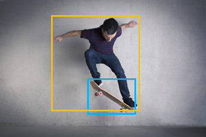
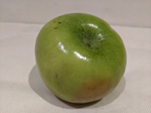
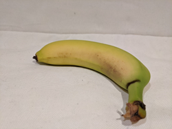
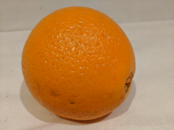
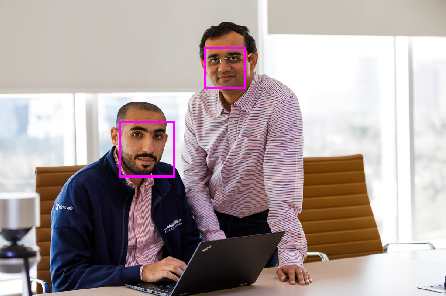
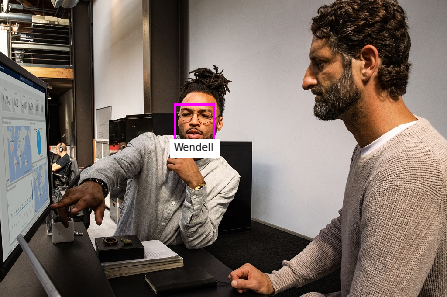
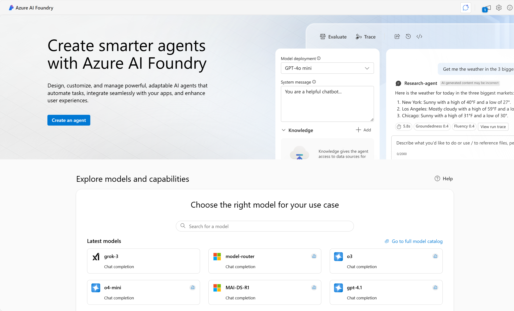
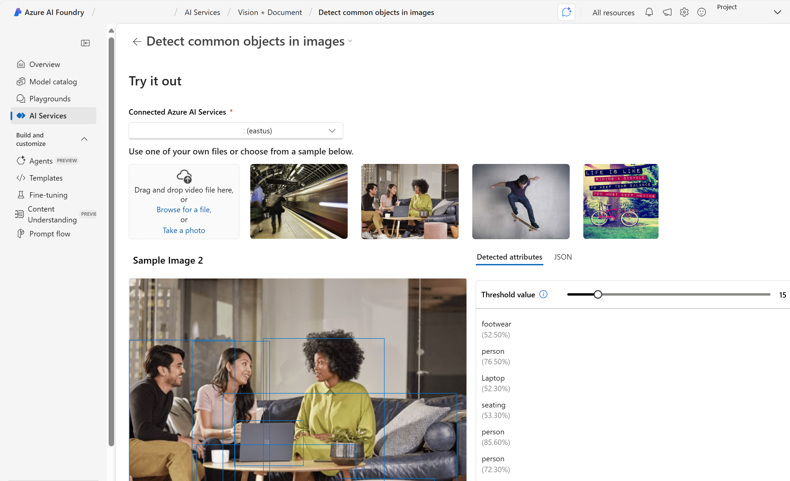

# 👀 What’s Computer Vision? Let’s Break It Down!

Computer vision is like giving super-eyes to machines! 🦾👁️  
It’s a part of AI (artificial intelligence) that helps tech understand what it sees—photos, videos, even live camera feeds. Cool, right?

It’s not just smart—it’s a time-saver and a game-changer. Let’s check out how it’s used in the real world:

---

## 🏭 Manufacturing – Spot the Oops!

Machines scan products zoom-zoom on the assembly line.  
They catch scratches, missing parts, or things out of place using smart image tools.  
Less waste, better quality. Boom! 💥

---

## 🏥 Healthcare – Scan Like a Pro

AI helps doctors look at X-rays, MRIs, and CT scans.  
It can point out stuff like tumors or broken bones early on.  
That means faster help and fewer mistakes. 🩻💡

---

## 🛍️ Retail – Shelf Check, Real Quick

Stores use cameras to watch shelves.  
If something’s missing or in the wrong spot, AI notices and updates inventory instantly.  
No more empty shelves = happy shoppers! 🛒✨

---

## 🚗 Transportation – Self-Driving Smarts

Self-driving cars use computer vision to see road signs, lanes, people, and other cars.  
It helps them drive safely and make smart choices on the go. 🛣️🤖

---

## ☁️ Build Your Own AI Vision!

Want to make your own computer vision magic?  
You can use **Microsoft Azure AI Vision**—a cloud service that lets developers create all kinds of vision-powered apps. 🧠💻

# 🧠💻 Get to Know Azure AI Vision (The Cool Way!)

## 🚀 What’s Azure AI Vision?

Azure AI is like a cloud-powered brain 🧠 in the sky ☁️. It helps machines *see* and *understand* stuff—like pics, videos, and faces. Microsoft’s **Azure AI Vision** gives you ready-to-use tools AND lets you build your own custom models using your own images. 🎨📸

---

## 🧩 What’s Inside Azure AI Vision?

### 🖼️ Image Analysis Service
- Spots objects in pics 🧸
- Tags visual features 🏷️
- Writes captions ✍️
- Reads text with OCR 🔍

### 😃 Face Service
- Detects and recognizes faces 👥
- Analyzes facial features 😎
- Goes deeper than regular image tools 🔬

## 💡 Real-World Superpowers

Here’s how Azure AI Vision is making life cooler:

- **🔍 Search Boost** – Tagging and captions help websites rank better.
- **🧼 Content Safety** – Detects sketchy images online.
- **🔐 Security** – Face unlock for buildings and devices.
- **📸 Social Media** – Auto-tag your besties in photos.
- **🕵️ Missing Persons** – Spot people using public cams.
- **🛂 Identity Check** – Validate people at border kiosks.
- **🏛️ Museum Magic** – OCR saves info from old paper docs.

---

> 💡 **Note:**  
Modern vision tools mix and match features!  
For example, **Azure AI Video Indexer** uses Face, Translator, Image Analysis, and Speech to analyze videos like a pro 🎥🧠.

---

## 🔍 What’s Next?

Let’s dive into the core features of **Azure AI Vision Image Analysis** and see what it can really do! 💥

# 🧠✨ Azure AI Vision Image Analysis – Let’s Gooo!

## 📸 What’s the Deal?

Azure AI Vision is like giving your computer superhero eyes! 🦸‍♀️👀  
It can look at pics and instantly know what’s going on—no training wheels needed!

## 🔍 Built-In Powers (No Customization Needed!)

### 🗣️ Caption It!

It looks at a pic and writes a caption like a pro.  
**Example:**  
🛹 *Image:* A person on a skateboard  
🧠 *Caption:* “A person jumping on a skateboard”  
Boom. Nailed it.

### 🧠 Object Spotting
It finds stuff in images and tells you how sure it is.  
**Example:**  
- Skateboard (🎯 90.40%)  
- Person (🎯 95.5%)  
It even gives you the exact spot with bounding boxes. 📦

### 🏷️ Tag It Up!
It slaps on smart tags so you can search and sort like a boss.  
**Example Tags for Skateboarder:**  
`sport`, `person`, `footwear`, `skating`, `kickflip`, `extreme sport`, `air`, `young`, `outdoor`  
(And like 20 more 🔥)

### 🔡 OCR = Text Detective
It reads text in images like a snack label at the store.  
**Example Output:**  

Nutrition Facts
Serving size: 1 bar (40g)
Total Fat: 13g
Calories: 190
Sodium: 20mg
Vitamin A: 50

---

## 🧪 Wanna Go Custom? You Can!

If the built-in stuff isn’t enough, train your own model! 🎓  
Azure AI Vision lets you build custom models using just a few images.

### 🍎 Image Classification
Teach it to tell apples from bananas from oranges.  
**Example:**  
- 🍏 Apple  
- 🍌 Banana  
- 🍊 Orange 

### 🔍 Object Detection
Train it to find multiple things in one image.  
**Example:**  
- Detect all the fruits in a fruit bowl 🥝🍇🍓

---

> 💡 **Heads Up:**  
Training custom models is next-level stuff.  
Check out the Azure AI Vision docs for the full how-to!

---

## 😃 What’s Next?

Let’s roll into the **Face Service** and see how Azure AI spots and understands faces like a genius! 🧠📷

# 😎 Azure AI Face Service – Let’s Talk Face Magic!

---

## 🧠 What’s Azure AI Face?

It’s like giving your app superhero powers to *see faces* and *know stuff*! 🦸‍♂️📸  
From unlocking doors to spotting your friends in pics—Face is on it.

---

## 👀 Face Detection – Spot That Face!

Face detection finds faces in pics and draws boxes around them.  

It can even map out facial features like:
- 👃 Nose  
- 👁️ Eyes  
- 👄 Lips  
- 🧑‍🦱 Eyebrows  
All the details for next-level analysis!

## 🧑‍🎓 Face Recognition – Who’s That?

Train it with a few pics of someone, and it’ll recognize them in new ones.  

It’s smart, secure, and super useful—when used responsibly. ✅

---

## 🛠️ What Can Azure AI Face Do?

Here’s the cool stuff it returns when it spots a face:

- 🕶️ **Accessories** – Glasses, hats, masks? It sees them.
- 🌫️ **Blur** – Is the face fuzzy or crisp?
- 💡 **Exposure** – Too dark or too bright?
- 🧭 **Head Pose** – Which way is the face looking?
- 😷 **Mask** – Mask on or off?
- 📢 **Noise** – Is the image grainy?
- 🚧 **Occlusion** – Is something blocking the face?
- 🎯 **Quality for Recognition** – Is the pic good enough to ID someone?

---

## 🛡️ Responsible AI – Play It Safe

⚠️ Azure AI Face follows Microsoft’s **Responsible AI Standard**.  
Some features need special access. You’ll need to fill out a form to unlock:

- 🧍‍♂️ **Face Verification** – Compare faces for similarity  
- 🧑‍💼 **Face Identification** – Spot known people  
- 🧠 **Liveness Detection** – Check if the video is real or fake

---

## 🚀 What’s Next?

Let’s jump into how to **get started** with Azure AI Vision and build something awesome! 💥

# 🚀 Get Started with Azure AI Foundry – Let’s Build Some Vision Magic!

## 🧠 What’s Azure AI Vision?

It’s like giving your apps superpowers to *see* and *understand* the world! 🌍👀  
You can build cool stuff using:

- 🧪 **Azure AI Foundry portal**  
- 💻 **SDKs or REST APIs**  
- 🔧 **Azure resources**

---

## 🛠️ Pick Your Power-Up: Resource Types

To use Azure AI Vision, you need to create a resource in your Azure subscription. Choose your fighter:

### 🎯 Azure AI Vision (Solo Mode)
Just want Vision? Use this to track usage and costs separately.

### 🧠 Azure AI Services (Squad Mode)
Want to use Vision *plus* other AI tools like Language, Translator, or Custom Vision? This one’s for you!

---

> 💡 **Pro Tip:**  
You can create resources using a UI or scripts.  
Use the **Azure AI Foundry portal** if you want to see live examples and test stuff out!

---

## 🧪 What’s Azure AI Foundry?

It’s your all-in-one playground for building AI magic! 🧙‍♂️✨  
Foundry is built around **hubs** and **projects**:

- 📁 **Projects** = your workspace for datasets, models, and resources  
- 🧪 Try features with sample images or upload your own  
- 🧠 Build, test, and launch AI apps like a boss

---

---

## 🎬 What’s Next?

# 🧠 Azure AI Vision & Face Service Quiz

---

## 1️⃣ You want to use the Azure AI Vision service to identify the location of individual items in an image. Which of the following features should you retrieve?

- [ ] **Objects**
- [ ] Visual Tags
- [ ] Dense Captions

---

## 2️⃣ How does the Face service indicate the location of faces in images?

- [ ] A pair of coordinates for each face, indicating the center of the face  
- [ ] Two pairs of coordinates for each face, indicating the location of the eyes  
- [ ] **A set of coordinates for each face, defining a rectangular bounding box around the face**

---

## 3️⃣ Which of the following is a benefit of using the Azure AI Foundry portal for Azure AI Vision?

- [ ] It only supports facial recognition features  
- [ ] **It provides a user interface with hubs and projects to organize and test AI services**  
- [ ] It limits access to only one Azure AI service at a time

